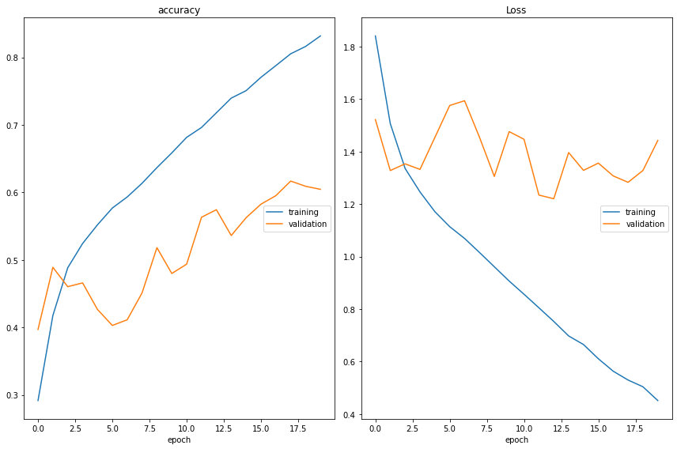

# Real time facial emotion detector from a live video stream

In this project, I have developed a webapp, which can be deployed on your local server, which classifies facial expressions from a live video stream into seven categories of emotions - angry, disgusted, fearful, happy, neutral, sad and surprised. 

The CNN model is trained on the **FER-2013 dataset**, which consists of 35887 grayscale images, each with resolution of 48 x 48 pixels. 

*Step by step instructions implementation from data setup to deployment coming soon*


## Table of Contents

1. [Installation] (#Installation)
2. [Model] (#Model)

 
# Installation

To install the app on your local server,

1. Ensure that the dependencies are installed on your system
    * python
    * opencv
    * tensorflow

2. Download the following files
    * index.py
    * templates folder
    * camera.py
    * model.py
    * model_structure.json
    * model_weights.h5

3. Go the the Command Prompt, and go to the directory where the above files are located, and run the following command.

```
python index.py
```

4. You will see the link to the server URL port on which the application is running. Go to that link on your web browser to run the app.


# Model

I implemented a Convolutional Neural Network Model with 4 convolutional layers and 2 dense layers. The model was trained for 20 epochs with a learning rate of 0.0005. The model achieved training accuracy of 83.18% and testing accuracy of 60.32%.




## Source code

1. Download the data-set from https://www.kaggle.com/datasets/msambare/fer2013 


* For importing and pre-processing data, refer to FER Data Setup.ipynb

* For training the model, refer to FER Training model.ipynb

* For model evaluation and testing, refer to FER Model Evaluation.ipynb

* The trained model files are :
    * model_structure.json
    * model_weights.h5


